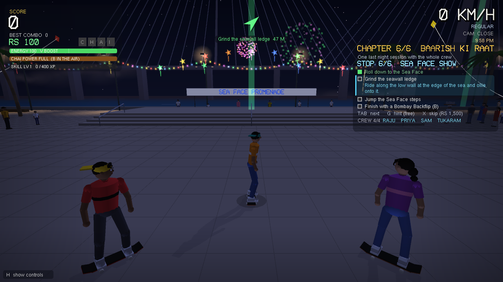
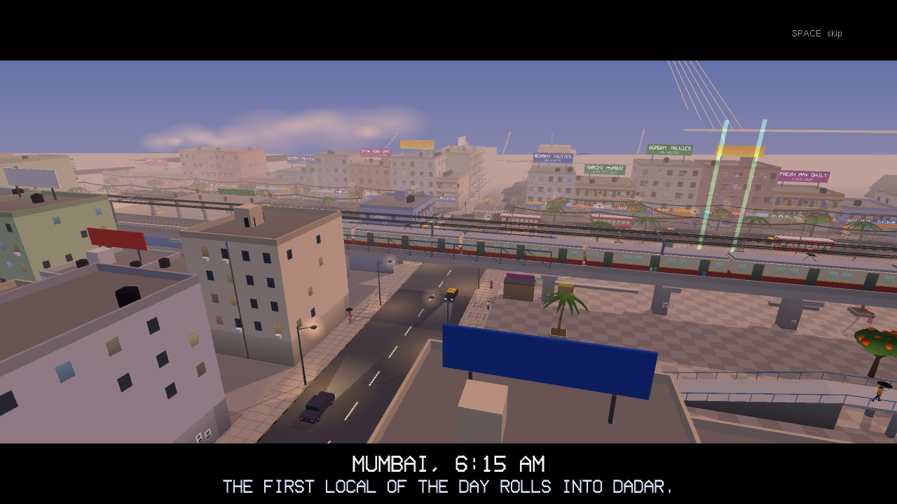
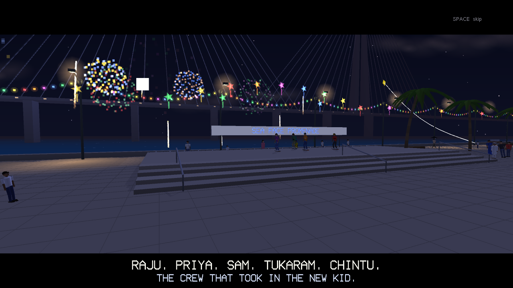
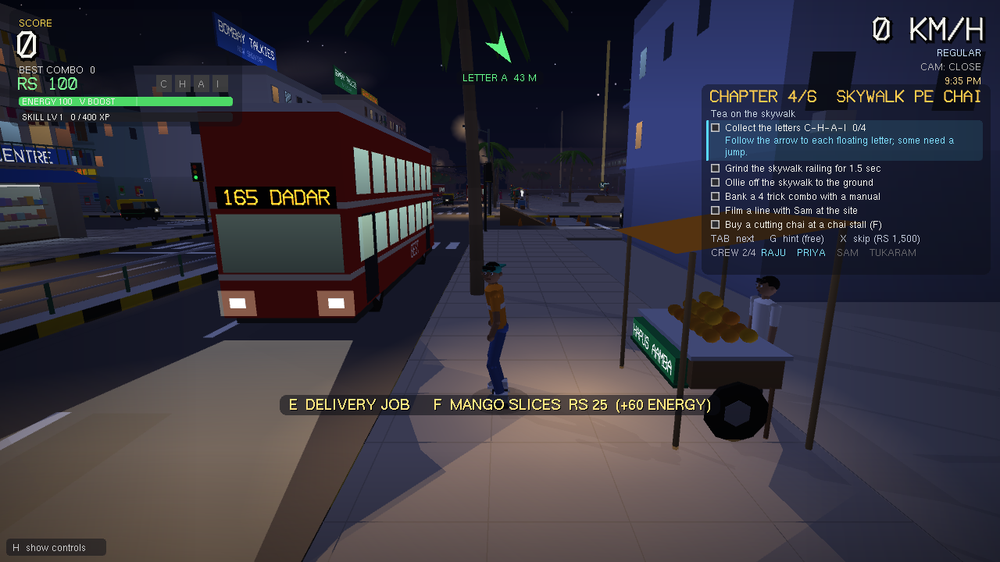
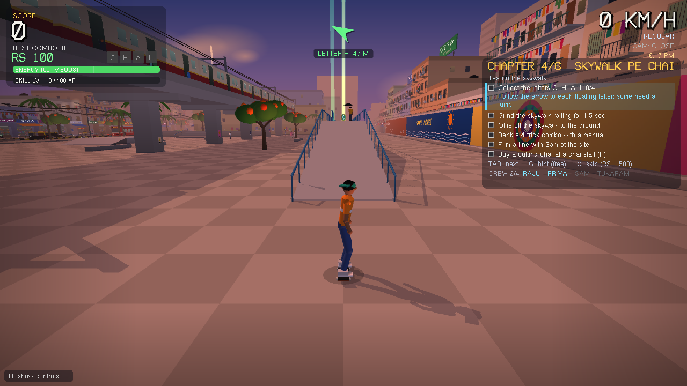
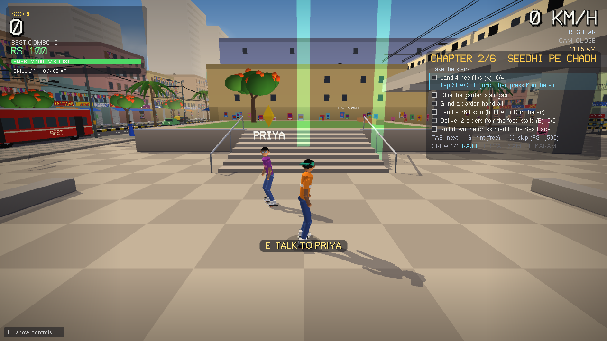

# Mumbai Skate

A 3D skateboarding game set on one Mumbai block: BEST buses, auto rickshaws, local trains on the viaduct, chai and vada pav stalls, chawls with laundry on the balconies, and a plaza built for skating. It is written in C++ with OpenGL and GLUT. There are no asset files, so it runs as soon as it compiles.



## Highlights

| | |
|---|---|
|  |  |
| The opening film, dawn over Dadar | The ending film, the whole crew on the Sea Face |
|  |  |
| Night on the main road: lit buses, headlights, street lamps | Sunset in the plaza under the railway bridge |



- Six chapters and 47 story tasks. Tricks, gaps and areas open as you go.
- Five friends with their own missions. In the finale they all ride with you.
- A day that runs from dawn to night, with lit windows, headlights, stars and a moon.
- Food deliveries, a job board, a skate shop with decks, clothes and accessories, energy and a boost.
- Easy, Medium and Hard, a 17-step tutorial, hints and a paid skip for stuck tasks.
- Low, Medium and High graphics, with a frame cap, so a laptop stays cool.
- Everything is drawn in code. There are no image, model or sound files.

## Build and run

```bash
make
./mumbai_skate
```

The first build needs Xcode's command line tools on macOS, or freeglut on Linux. Compile commands for each platform are at the top of `src/main.cpp`. Progress saves to `~/.mumbai_skate_save` whenever you finish a task or quit.

## Title screen, difficulty and tutorial

The game opens on a title screen. W and S move through the menu, A and D change a setting, and Enter selects. From here you can continue or start, pick a difficulty, graphics and time of day, switch the tutorial on or off, or start a new game (Enter twice, because it erases the save). P or Esc opens the same settings mid-game.

| | Easy | Medium | Hard |
|---|---|---|---|
| Tricks | all open from the start | unlock with the story | unlock with the story |
| Trick counts ("land 5 heelflips") | about 60% | about 80% | full |
| Combo and score targets | half | three quarters | full |
| Mission timers | 1.7x | 1.3x | as written |
| Landings, grind and manual balance | very forgiving | forgiving | strict |
| Raju in the race | slow, waits for you | waits for you | flat out |

### Graphics

**Graphics** in the title and pause menus trades looks for heat and battery. The game only draws what the camera can see and never runs faster than its frame cap:

| | Low | Medium (default) | High |
|---|---|---|---|
| Frame cap | 30 fps | 60 fps | 60 fps |
| View distance | 130 m | 200 m | 290 m |
| Sun shadows | only under your skater | city, you and traffic | everything, pedestrians too |
| Anti-aliasing, clouds | off | on | on |

Menus, the shop and the pause screen drop to 20 fps, and a minimised window stops drawing. If a laptop runs hot, pick Low. `./mumbai_skate --graphics low` sets it for one run, and `./mumbai_skate --bench` prints frame times for all three.

### Time of day

A clock in the top right corner runs while you skate. One game hour takes 90 seconds, so the light changes during a chapter: golden hour around 5 PM, sunset near 6:30, then night. After dark the windows, shops, signboards and street lamps light up, buses show their tube lights and route boards, and traffic runs with headlights. Local trains go past with lit windows, and the Sea Link has lights along its deck.

Each chapter starts at its own hour, from 8:30 AM for chapter 1 to 9 PM for the finale. When you finish a chapter the sky fast-forwards to the next one behind the card. **Time of day** in the title and pause menus can also fix it at day, evening or night.

### Opening and ending films

A new game opens with a short film: dawn over Dadar, the first local train, the buses and chai stalls, the plaza, and then you, the new kid with a hundred rupees. Finishing the finale plays the ending: the crew and the crowd on the Sea Face at night, fireworks over the sea, and the credits. Both use camera moves over the live city. Space, Enter or Esc skips.

The tutorial runs before chapter 1 on a new game. It has 17 short steps:

- the basics: push, carve, brake, ollie, the charged pop
- flips: kickflip, heelflip, shove-it, then mixed flips like the varial and the double
- spins, grabs, grinding and manuals
- linking a combo, the powerslide and the boost
- talking to people

Each step says what the move is and which keys to press, and waits until you land it. T skips a step.

## How the game is laid out

The story has six chapters and 47 tasks. Every chapter opens something new, so tricks are earned rather than handed out.

| Chapter | Where | What you unlock when it's done |
|---|---|---|
| 1. Pehla Din | the plaza | heelflip, pop shove-it, grind switches, the garden steps |
| 2. Seedhi Pe Chadh | the garden stairs | indy and melon grabs, the construction site |
| 3. Site Pe Session | the construction site | manuals, the skywalk, the C-H-A-I letters |
| 4. Skywalk Pe Chai | the skywalk | chai power and the Bombay Backflip |
| 5. Traffic Ka Raja | the road kicker, over the traffic | the kaali-peeli deck, the finale |
| 6. Baarish Ki Raat | a night tour of the whole block with the crew, ending at the Sea Face | the gold deck and free skate |

Tasks mix tricks with the rest of the block. For example, chapter 2 asks for five heelflips and two food deliveries, and chapter 5 wants a jump over a BEST bus. A green beam marks any task that happens in one place, and the arrow at the top of the screen points to the nearest one.

### The finale

Chapter 6 is one monsoon night with everyone. It has no clock. It plays as six stops, each with three or four short tasks, and each stop opens when the one before it is done:

1. Raju in the plaza: a kickflip and the yellow bar
2. Priya at the garden: two heelflips and the stair gap
3. Sam at the construction site: a grab and the concrete pipe, for his camera
4. Chai for the crew, taken to Tukaram at Dadar station. The rain stops here
5. The main road: a median hop, a spin and a small combo while the street watches
6. The Sea Face show: the seawall, the steps and a Bombay Backflip

Once you meet a friend, they ride beside you for the rest of the night. For the last stop, festival lights and lanterns go up along the lane and the promenade, a crowd gathers round the viewing deck and cheers your combos, Tukaram comes to watch, and fireworks go off over the sea. Your chai power stays full, so the backflip is always ready. Each stop pays RS 150.

### The Sea Face

Follow the cross road south, down a lane of shops, and it opens onto the Sea Face promenade. It has:

- a seawall ledge that runs the length of the block
- a stepped viewing deck with three handrails and a gap down the steps
- a manual pad and a kicker
- bhutta and baraf gola carts
- kids flying kites, with the Sea Link out in the haze

Chintu, one of the kite kids, pays you to fetch his kites after they get cut loose.

### Friends

Four locals give side missions. Beating a mission the first time adds that friend to your crew. Crew members then skate their own loop around the block and shout when you land a big combo nearby.

- **Raju**, in the plaza: race him to Dadar station through the rings.
- **Priya**, by the garden: a 90 second trick challenge.
- **Sam**, at the construction site: film a line in 75 seconds.
- **Tukaram**, the dabbawala at the station: deliver three tiffins in three minutes. A bail knocks one off.

A yellow diamond over someone's head means they have a mission ready. Ride up, stop, and press **E**.

### Deliveries and rupees

Every food stall has delivery jobs. Stop at a stall, press E, and it tells you the order and the address (a chawl room, a shopfront, the station ticket window). A timer starts when you accept. Bails damage the order, and cutting chai spills on the first one. Tricks along the way add a style tip.

Rupees buy gear at the **Skate Crew Adda**, a plywood shop under the railway bridge next to the plaza:

- bearings for more top speed
- soft wheels for grip in the rain and softer sketchy landings
- a pro deck that pops higher
- ledge wax that steadies grinds and manuals
- decks, outfits and accessories: snapback, bucket hat, Gandhi topi, beanie, aviators, round specs, gold chain, gamcha, backpack. They're all drawn on your skater, and Enter takes one off again

### Energy, food and boost

The bar under your score is energy. **V** spends some of it on a boost: a few seconds of extra push and top speed. Energy creeps back on its own up to about half, faster when you stand still. To fill it all the way, eat. Stop at any stall and press **F**:

| Stall | Food | Price | Energy |
|---|---|---|---|
| chai | cutting chai (also fills chai power) | RS 10 | +30 |
| vada pav | vada pav | RS 15 | +50 |
| paan | meetha paan | RS 10 | +25 |
| bhel | bhel puri | RS 20 | +45 |
| fruit | mango slices | RS 25 | +60 |
| sea face carts | bhutta / baraf gola | RS 20 / 15 | +45 / +35 |

Below 15 energy you are tired and push a little slower. A bail costs 8. New games start with RS 100 in your pocket.

### Skill levels and the job board

Banked combos, deliveries, missions and jobs all give XP. Every skill level (up to 10) pops a little higher, pushes a little faster and wobbles a little less on rails and manuals. The bar under your energy shows how close the next level is.

The **job board** stands next to the skate shop under the railway bridge. It always has three jobs posted, and taking one posts a new one. Jobs pay more than food deliveries and give more XP:

| Job | What you do | Pay |
|---|---|---|
| Paper round | ride past 5 doors with the evening papers | RS 450 |
| Score attack | bank a target score against the clock | RS 350 |
| Sponsor photo shoot | clear 3 named gaps for the camera | RS 550 |
| Trick list | land 3 named tricks | RS 450 |
| Combo king | bank one long combo | RS 350 |
| Grind session | hold one long grind | RS 350 |

Pay grows a little with your skill level. Stop at the board, press E, then 1, 2 or 3.

### Stuck on a task?

The focused task in the panel is highlighted and shows how to do it underneath, for free. **Tab** moves the focus to the next task, and the arrow follows it. **G** opens a full walkthrough for the focused task: where it is, what to press, and what usually goes wrong. Walkthroughs are free on Easy. On Medium they cost RS 20 and on Hard RS 30, but the first one each chapter is free. Once bought, a walkthrough stays open to you.

Still stuck? **X** (twice, to confirm) buys your way past the focused task: RS 1,000 on Easy, RS 1,500 on Medium, RS 2,000 on Hard. It works on chapter tasks and on individual steps of a mission.

### Chai power

From chapter 5 on (from the start on Easy), a meter under your score fills as you bank combos. Buying a cutting chai at a chai stall fills it at once. When it's full, you push faster and wobble less, and **B** in the air throws a Bombay Backflip worth 2,500 points.

## Controls

| Key | Action |
|---|---|
| W / S or arrows | push, brake (brake at speed for a powerslide) |
| A / D | turn; spin in the air; balance on a rail |
| Space | ollie. Hold to crouch, release to pop higher |
| J / K / L | kickflip, heelflip, pop shove-it. Tap again mid-flip for doubles, varials, 360 flips |
| I / U | indy and melon grabs, held |
| N / M | manual and nose manual (W / S to balance) |
| B | Bombay Backflip |
| V | boost (uses energy) |
| F | eat or drink at a stall |
| Tab / G / X | next task / hint for it / pay to skip it |
| 1 / 2 / 3 | take a job at the job board |
| E / Q | talk and accept / decline or give up a mission |
| T | skip a tutorial step |
| C, R, H | camera, respawn, hide help |
| P or Esc | menu (difficulty, graphics, time of day, tutorial, quit) |

To link tricks into one combo, land and then keep moving within the short window. A powerslide, a manual or another ollie all count.

## For developers

`make test` runs `./mumbai_skate --selftest`. It is a set of scripted runs through the real physics, career and mission code. It checks ollie heights, the kicker gap, clearing a bus off the road kicker, barricades, locked tricks, chapter completion, a full delivery, both outcomes of Raju's race, the difficulty scaling, the tutorial, and a save file round trip.

`--level N` starts with N chapters finished, and `--level 5 --stop 6` jumps to a stop of the finale. `--time 21.5` starts the clock at an hour. `--cutscene intro` plays the opening film, and `--level 6 --cutscene ending` the ending. None of them touch your save.
